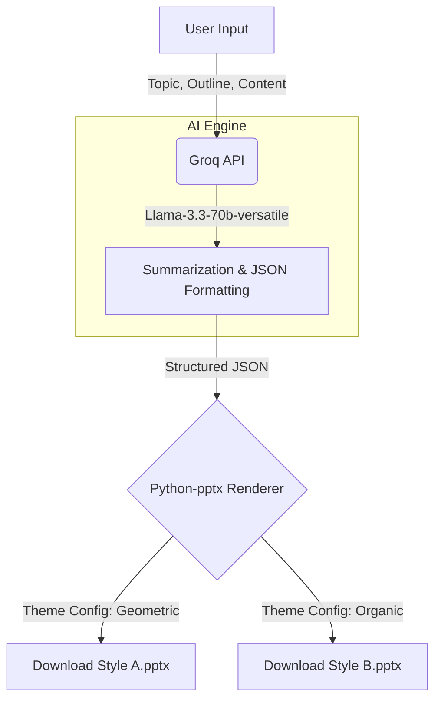

# 🤖 AI Auto-Presentation Generator
  

這是一個基於 **GenAI (Generative AI)** 的自動化簡報生成工具。
使用者只需輸入主題、大綱與詳細內容，系統即會透過 **Groq (Llama 3.3)** 進行語意理解與摘要，並利用 `python-pptx` 自動繪製出兩種不同風格的 PowerPoint 簡報。

## ✨ 功能特色 (Features)

  * **📝 智慧內容結構化**：使用 LLM 將散亂的長篇文章整理為邏輯清晰的 JSON 簡報架構。
  * **🎨 雙重風格生成**：
      * **Style A (Professional / Geometric)**：適合商務會議，幾何線條與穩重配色。
      * **Style B (Creative / Organic)**：適合創意提案，高對比配色與圓潤裝飾。
  * **⚡ 極速生成**：採用 Groq LPU 推論引擎，分析與生成結構僅需數秒。
  * **🔒 使用者主控**：不依賴 AI 瞎編，而是基於使用者提供的真實內容進行排版與潤飾。

## 🛠️ 技術架構 (Architecture)

本專案將 AI 的「大腦」與 Python 的「手」結合：



### 核心技術棧

  * **Frontend**: [Streamlit](https://streamlit.io/) (Web UI)
  * **AI Inference**: [Groq Cloud API](https://groq.com/) (Model: `llama-3.3-70b-versatile`)
  * **PPT Engine**: [python-pptx](https://python-pptx.readthedocs.io/)
  * **Logic**: Python 3

## 🚀 快速開始 (Quick Start)

### 1\. 安裝依賴

確保您的電腦已安裝 Python，然後執行以下指令安裝所需套件：

```bash
pip install -r requirements.txt
```

*`requirements.txt` 內容：*

```text
streamlit
python-pptx
groq
```

### 2\. 獲取 API Key

本專案需要 **Groq API Key** 才能運作。

  * 前往 [Groq Console](https://console.groq.com/) 免費申請 API Key。

### 3\. 啟動應用程式

在終端機 (Terminal) 執行：

```bash
streamlit run app.py
```

瀏覽器將會自動開啟 (預設為 `http://localhost:8501`)。

## 📂 程式碼結構說明 (Code Structure)

  * **`app.py`**: 主程式入口。
      * `structure_content_with_ai()`: 負責 Prompt Engineering，強制 Llama 模型輸出嚴格的 JSON 格式。
      * `create_styled_ppt()`: 視覺化核心。讀取 JSON 資料，根據傳入的 `style_config` (顏色、字型、形狀) 在 Slide Master 上繪圖。
      * `Streamlit UI`: 處理使用者輸入表單與檔案下載邏輯。

## 🖼️ 展示 (Demo)

### 操作介面


### 輸出範例

| Style A: Professional | Style B: Creative |
|:---:|:---:|
| ||
| 白底、紅色系、方正色塊 | 深底、高對比、圓形裝飾 |

## 💡 開發筆記 (Development Notes)

  * **Prompt Engineering**: 為了讓 Python 能精準解析 AI 的產出，使用了 `response_format={"type": "json_object"}` 模式，並在 Prompt 中定義了明確的 JSON Schema。
  * **模型選擇**: 原始嘗試使用 Llama 3，後因 Groq 更新，遷移至效能更強的 `llama-3.3-70b-versatile`。


## Streamlit Web
https://custom-content-different-style-ppt-generator-rytofuvcrby8uzvyb.streamlit.app/
